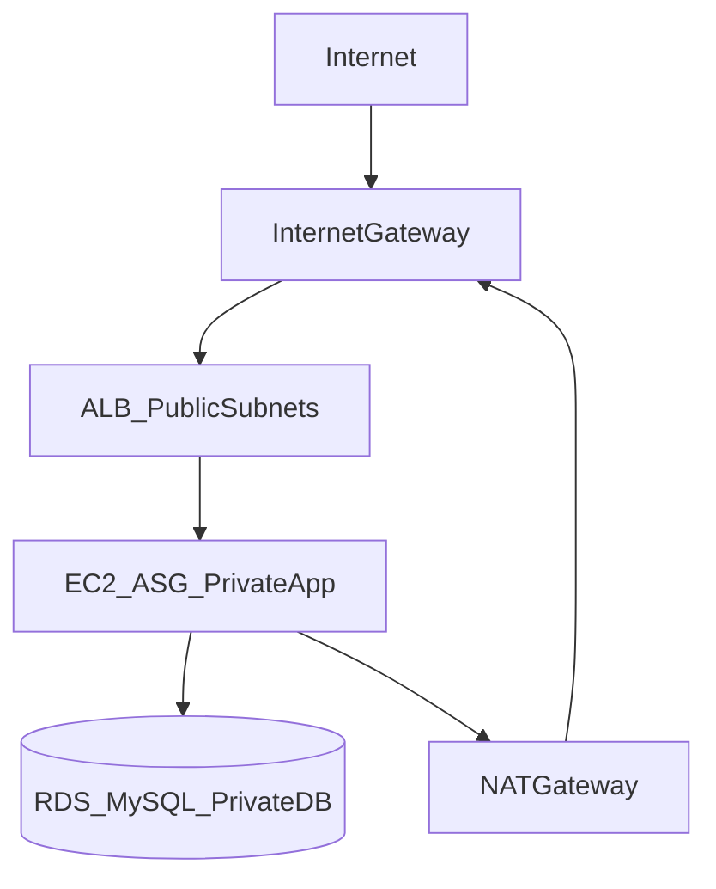

# AWS Three-Tier Infrastructure with Terraform

Production-style, highly available AWS application architecture managed entirely through Terraform.

**Internet → ALB → EC2 Auto Scaling Group → RDS MySQL**

## Architecture



### Network layout

| Tier | Subnets | CIDR | Routing |
|------|---------|------|---------|
| Public | 2 AZs | `10.0.1.0/24`, `10.0.2.0/24` | Internet Gateway |
| Private App | 2 AZs | `10.0.11.0/24`, `10.0.12.0/24` | NAT Gateway (outbound only) |
| Private DB | 2 AZs | `10.0.21.0/24`, `10.0.22.0/24` | Local VPC only (no internet) |

### Security model

- **ALB** accepts HTTPS from the internet (TLS terminated at the load balancer; backend uses HTTPS to the app tier).
- **App tier** accepts traffic only from the ALB security group.
- **RDS** accepts MySQL (3306) only from the app security group.
- **Admin access** uses SSM Session Manager (no bastion host, no open SSH).

## Modules

| Module | Purpose |
|--------|---------|
| `modules/vpc` | VPC, subnets, IGW, NAT, route tables |
| `modules/security` | Security groups for ALB, app, RDS |
| `modules/alb` | Application Load Balancer and target group |
| `modules/compute` | Launch template, ASG, IAM/SSM instance profile |
| `modules/database` | RDS MySQL subnet group and instance |
| `modules/monitoring` | CloudWatch alarms |

## Prerequisites

- Terraform >= 1.10
- AWS CLI configured with appropriate credentials
- S3 bucket for remote state (configured in `backend.tf`)

## Quick start

```bash
cp terraform.tfvars.example terraform.tfvars
terraform init
terraform plan
terraform apply
```

After apply, open the ALB URL:

```bash
terraform output alb_url
```

**Destroy when done** to avoid ongoing charges:

```bash
terraform destroy
```

## Cost estimate (us-east-1, lab sizing)

| Resource | Approx. cost |
|----------|--------------|
| NAT Gateway | ~$0.045/hr + data processing |
| ALB | ~$0.0225/hr |
| EC2 t3.micro | ~$0.0104/hr |
| RDS db.t3.micro | ~$0.017/hr |
| **Total** | **~$0.10/hr (~$2.40/day)** |

Destroy resources after each session to keep costs minimal.

## Trade-offs documented

### Single NAT Gateway vs per-AZ NAT

This project uses **one NAT Gateway** in the first public subnet to reduce cost (~$32/month savings vs two NAT Gateways). Trade-off: if `us-east-1a` fails, private subnets in `us-east-1b` lose outbound internet until the AZ recovers.

### Single-AZ RDS vs Multi-AZ

RDS runs **single-AZ** (`db_multi_az = false`) for lab cost. Set `db_multi_az = true` in `terraform.tfvars` for production-style HA.

## Failure test (portfolio evidence)

1. Apply the stack and confirm `curl -k $(terraform output -raw alb_url)` returns HTTP 200 (`-k` accepts the lab self-signed certificate).
2. In the AWS Console, terminate an EC2 instance in the ASG.
3. Wait 2–5 minutes; ASG launches a replacement and ALB health checks pass.
4. Optionally break the app security group (remove ALB ingress rule) and observe the `unhealthy-hosts` CloudWatch alarm.

## Interview talking points

- Public vs private subnets: route table determines internet reachability.
- NAT Gateway enables outbound internet from private subnets without inbound exposure.
- Security groups enforce least-privilege traffic between tiers.
- Terraform modules, variables, and outputs enable reusable IaC.
- Remote state in S3 with locking protects team collaboration.

## CI/CD

- **PR checks** (`.github/workflows/terraform-checks.yml`): `fmt`, `init`, `validate`
- **Security scans** (`.github/workflows/devsecops.yml`): Gitleaks, Checkov
